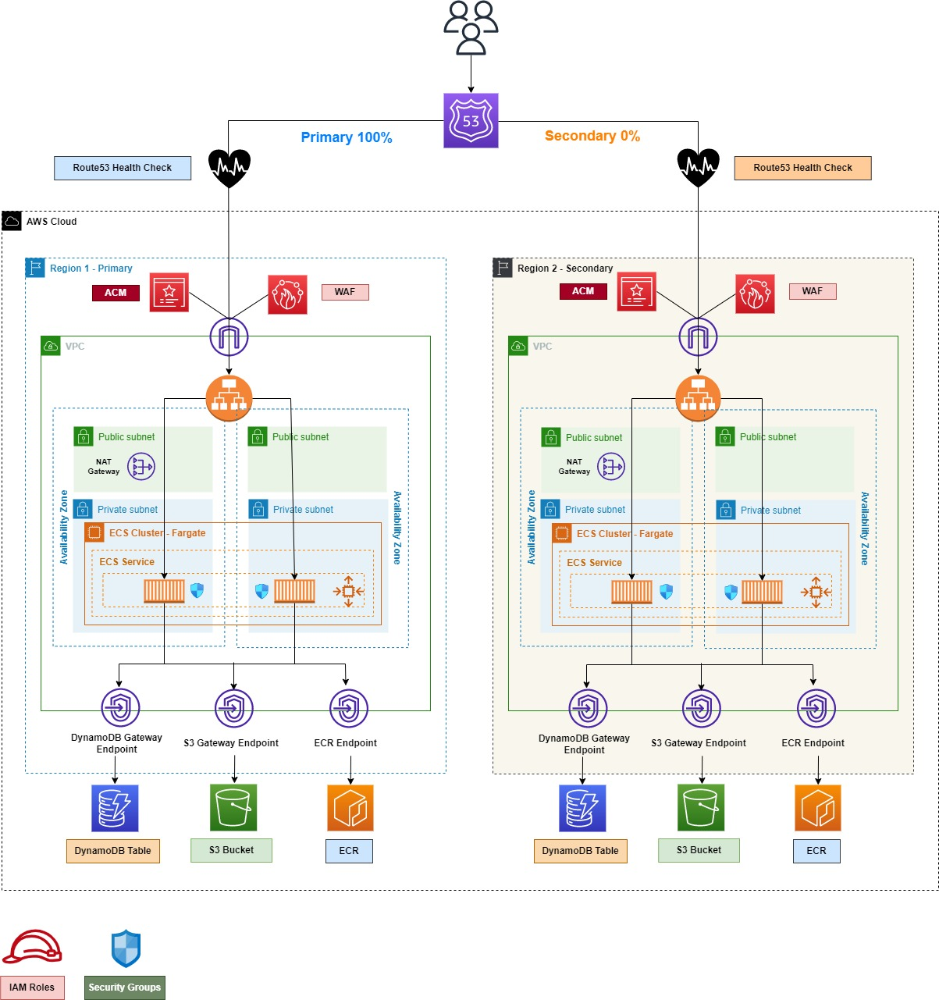

# Multi-Region Web App to handle Disaster Recovery

This Terraform Project is used to Setup a Multi-Region Web APP deployed using AWS ECS Fargate and exposed publicly using an Application Load Balancer.

The Whole Infrastructure will be deployed to a **Primary Region** and a **Secondary Region** of your choice, based on the Terraform Providers you will setup to run the project.

The **DR Strategy** is based on **Route53 Health Checks** which will swtich to the **Secondary Region** in case of a **Primary Region** Failure.

The below Diagram describes the App Infrastructure :

## **What to excpect by applying this terraform project :**
This project supports creating resources through individual sub-modules, it's mainly based on two main modules **global** and **regional** which you can find under the **factories** directory.

The **global** module is used to create non-region related resources "for example IAM Roles" while the **regional** module is used to create region related resources "for example an ALB or an ECS Cluster".

Under the **regional module** you can find three other sub-modules ***vpc***, ***ecr*** and ***ecs*** which are needed to create the resources shown in the above diagram.

here is a list of the resources that will be created by each sub-module :

- **VPC Sub-Module** :
    - A **Public Subnet** for each AZ in the **Primary** and the **Secondary** Regions based on the provided **VPC Cidr**
    - A **Private Subnet** for each AZ in the **Primary** and the **Secondary** Regions based on the provided **VPC Cidr**
    - An **Internet Gateway**
    - a **NAT Gateway** using one of the Public Subnets
    - a **Public Route Table** for Public Subnets
    - a **Private Route Table** for Private Subnets
    - **S3 & DynamoDB** Gateway Endpoints with their relative routes in both **Public & Private** Route Tables
- **ECR Sub-Module** :
- **ECS Sub-Module** :     

<!-- blank line -->
-  **Inputs :**

The following inputs should be added to the **metadata.yml** 

| **Input** 	| **Mandatory** 	|            **Default Value**            	|
|:---------------:	|------------	|:-----------------------------------:	|
|       domain_name      	| TRUE 	| Null 	|
|       domain_name_suffix      	| FALSE 	| webapp 	|
|       vpc_cidr      	| FALSE 	| 10.0.0.0/16 	|

