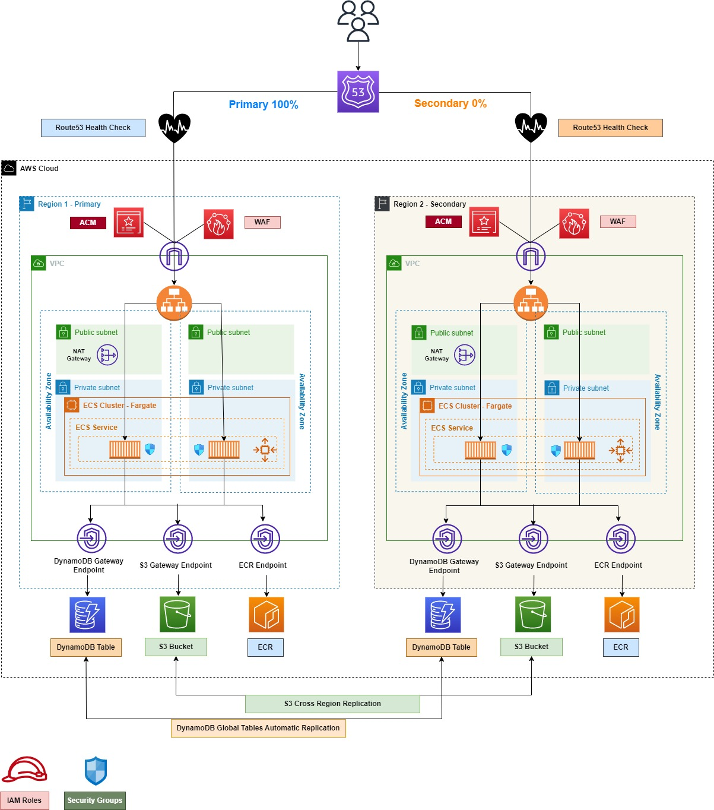

# Building a Secure, Mlti-Regional & Highly Available Web Application Infrastructure using Terraform

This Terraform Project is used to Setup a Multi-Region Web APP deployed using AWS ECS Fargate and exposed publicly using an Application Load Balancer.

The Whole Infrastructure will be deployed to a **Primary Region** and a **Secondary Region** of your choice, based on the Terraform Providers you will setup to run the project.

The **DR Strategy** is based on **Route53 Health Checks** which will swtich to the **Secondary Region** in case of a **Primary Region** Failure.

The below Diagram describes the App Infrastructure :



## What to excpect by deploying this terraform project ?
This project supports creating resources through individual sub-modules, it's mainly based on two main modules **global** and **regional** which you can find under the **factories** directory.

The **global** module is used to create non-region related resources "for example IAM Roles" while the **regional** module is used to create region related resources "for example an ALB or an ECS Cluster".

Under the **regional module** you can find three other sub-modules ***vpc***, ***ecr*** and ***ecs*** which are needed to create the resources shown in the above diagram.

here is a list of the resources that will be created by each sub-module :

<!-- blank line -->
- **VPC Sub-Module** :
    - A **Public Subnet** for each AZ in the **Primary** and the **Secondary** Regions based on the provided **VPC Cidr** [See Inputs](#inputs)
    - A **Private Subnet** for each AZ in the **Primary** and the **Secondary** Regions based on the provided **VPC Cidr** [See Inputs](#inputs)
    - An **Internet Gateway**
    - a **NAT Gateway** using one of the Public Subnets
    - a **Public Route Table** for Public Subnets
    - a **Private Route Table** for Private Subnets
    - **S3 & DynamoDB** Gateway Endpoints with their relative routes in both **Public & Private** Route Tables
<!-- blank line -->    
- **ECR Sub-Module** :
    - A ** Private ECR Repository** named ***web-app-repo***
    - A Repo **Lifecycle rule** to keep the last tagged 30 images
    - **Docker** Build, Tag and Push for a simple html page that you can find [here](factories/regional/ecr/webapp)
<!-- blank line -->    
- **ECS Sub-Module** :     
    - An **ECS Fargate Cluster** named ***APP-ECS-FARGATE***
    - A **Task Definition** using the **ECR Image** pushed by the **ECR Sub-Module**
    - Task Definition Role & Execution Role
    - An **ECS Service** using the created **Task Definition** and with **Autoscaling** enabled "Min Tasks=1 and Max Tasks=10"
    - An **Internet Facing ALB** for Service Public Exposure
    - A **Wild Card ACM Certificate** based on the provided **Public Domain Name** for **TLS Termination** [See Inputs](#inputs)
    - **DNS Validation** for the created Certificate
    - **Route53 Health Check** target the **FQDN** of the **Application Load Balancer** on port **443**
    - **Route53 Records** with **Failover** Routing Policy
    - **Failover Record Type** will be decided based on a flag named ***primary_region*** if true a ***Primary*** record will be created, otherwise a ***Secondary** one will be created

<!-- blank line -->
## How Resources are getting created in two different regions without the need to replicate the Terraform Code ?

As mentioned above, the main terraform module responsabile for creating a single APP Stack is the **regional module** with its three sub-modules ***vpc***, ***ecr*** and ***ecs***

In the [main.tf](main.tf) you can notice that the **regional module** is imported twice, each time with a different **Terraform AWS Proivder**.

```
##############################
## PRIMARY REGION
##############################

// regional Module
// for deploying regional resources
module "app_primary_region" {
  source = "./factories/regional"
  providers = {
    aws.dst = aws.primary-region
  }
  domain_name        = local.metadata.domain_name
  domain_name_prefix = local.metadata.domain_name_prefix
  vpc_cidr_block     = local.metadata.vpc_cidr
  primary_region     = true
  tags               = local.tags
}

##############################
## FAILOVER REGION
##############################

module "app_secondary_region" {
  source = "./factories/regional"
  providers = {
    aws.dst = aws.secondary-region
  }
  domain_name        = local.metadata.domain_name
  domain_name_prefix = local.metadata.domain_name_prefix
  vpc_cidr_block     = local.metadata.vpc_cidr
  primary_region     = false
  tags               = local.tags
}
```

Each **AWS Terraform Provider** should refer to an AWS Region in your AWS Account.

Another difference between the **Primary Region** and the **Secondary Region** is the ***primary_region*** flag value, which will be required to create **Route53 DNS Records** as shown below :

```
resource "aws_route53_record" "dns_record" {
  zone_id = data.aws_route53_zone.public-zone.zone_id
  name    = lower("${var.domain_name_prefix}.${var.domain_name}")
  type    = "A"

  alias {
    name                   = module.alb.lb_dns_name
    zone_id                = module.alb.lb_zone_id
    evaluate_target_health = true
  }

  set_identifier = var.primary_region ? "primary" : "secondary"
  failover_routing_policy {
    type = var.primary_region ? "PRIMARY" : "SECONDARY"
  }

  health_check_id = aws_route53_health_check.failover_healt_check.id

}
```

<!-- blank line -->
## Usage 

To be able to use this project, you will need the following : 
- A **Public Domain Name** registered or imported in **Route53**
- **Terraform Providers** referring to two different AWS Regions in your AWS Account with the necesary permissions to create all the resources listed [here](#what-to-excpect-by-applying-this-terraform-project) 

  ### Setup Providers :
    Under the main directory, you need to create a new ***provider.tf*** file with two different providers referring to two different AWS Regions as shown below : 
  ```
    provider "aws" {
    alias      = "primary-region"
    region     = "ADD YOUR PRIMARY REGION HERE"
    
    skip_metadata_api_check     = false
    skip_region_validation      = false
    skip_credentials_validation = false
    }

    provider "aws" {
    alias      = "secondary-region"
    region     = "ADD YOUR PRIMARY REGION HERE"

    skip_metadata_api_check     = false
    skip_region_validation      = false
    skip_credentials_validation = false
    }
  ``` 

<!-- blank line -->
## Inputs 

The following inputs should be added to the [metadata.yml](metadata.yml)

|      **Input**     	| **Mandatory** 	| **Example**      	|                                                 **Description**                                                	|
|:------------------:	|:-------------:	|------------------	|:--------------------------------------------------------------------------------------------------------------:	|
| domain_name        	| TRUE          	| petereskandar.eu 	| The Public Domain Name needed for the App Public Exposure and ACM Certificate Validation                       	|
| domain_name_suffix 	| TRUE          	| webapp           	| Needed for DNS records creation to expose the App publicly,for example : webapp.petereskandar.eu               	|
| vpc_cidr           	| TRUE          	| 10.0.0.0/16      	| The VPC Cidr is required to setup the Networking part in each region "VPC, Public Subnets and Private Subnets" 	|


<!-- blank line -->
## Future Improvements
- **Resource Naming :** 
    - At the moment most of the created resources has fixed names and need to be externalized using **T*erraform Variables***
- **Web Application & Infrastructure :** 
    - This project doesn't create any ***DynamoDB Tabls*** or ***S3 Buckets***, they are there in the diagram for demonstration purposes 
    - The Deployed Application on both regions is a simple ***index.html*** with a label that indicates the region of deployment "for Failover testing purposes" and I'm working on introducing a more complex use-case that involves ***DynamoDB Global Tables*** or ***Multiple S3 Buckets*** in two different AWS Regions with **Cognito** for Auth/Authz.


<!-- blank line --> 
****
**Any suggestions are much appreciated**
